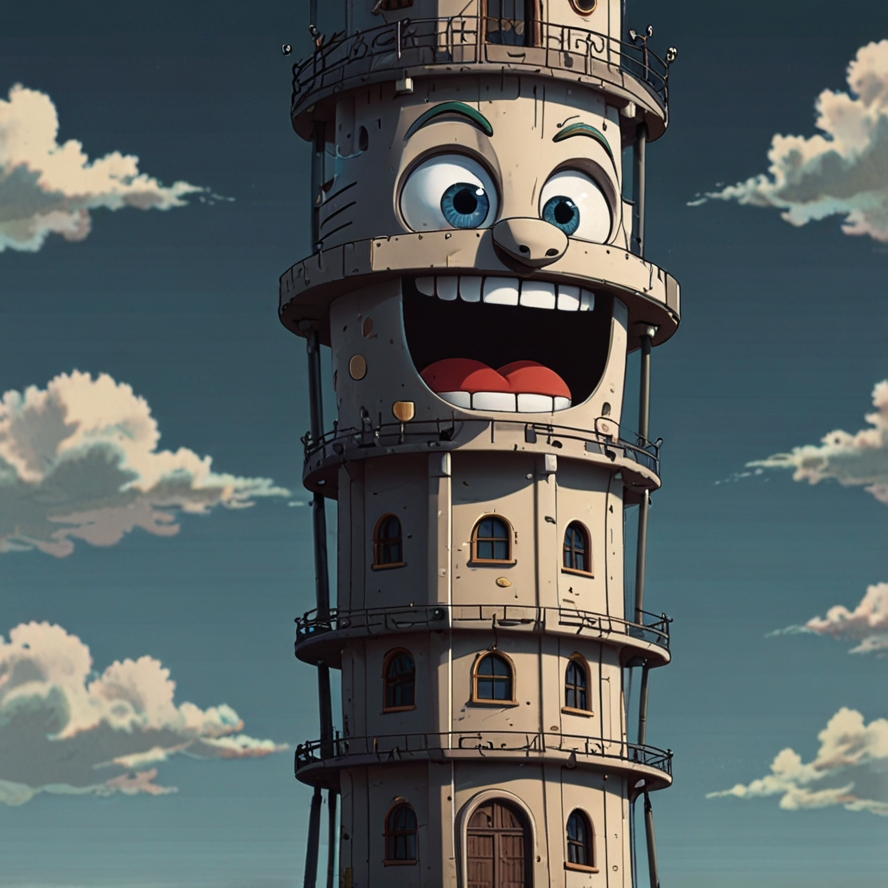

<h1>
TechTowers: 
</h1>

    preview do podcast

    <audio src="output/podcast.MP3" controls title="Podcast editado"></audio>

## 💻 Tecnologias utilizadas no projeto

- [ChatGPT](https://chat.openai.com/) 
- [ElevenLabs](https://beta.elevenlabs.io/)
- [Filmora](https://filmora.wondershare.net)
- [Leonardo.ai](https://leonardo.ai)

## ✨ Como foi feito ?

- Roteiro gerado via chatgpt
- Audio gerado pela elevenLabs
- Midjourney Para gerar capas
- Capcut para tratar aúdio e adicionar sons de fundo

## 👨‍💻 Expert

    
    <h3>&nbsp&nbsp&nbspKevin Santana </h3>
    
&nbsp&nbsp&nbsp
    <a href="https://github.com/zekdtonik">
    GitHub</a>&nbsp;|&nbsp;
    <a href="www.linkedin.com/in/kevin-fms">LinkedIn</a>
&nbsp;|&nbsp;
    <a href="https://www.instagram.com/keu_marxs/">
    Instagram</a>
&nbsp;&nbsp;

  

---

Criado por [Kevin Santana](https://github.com/zekdtonik) 💻💻